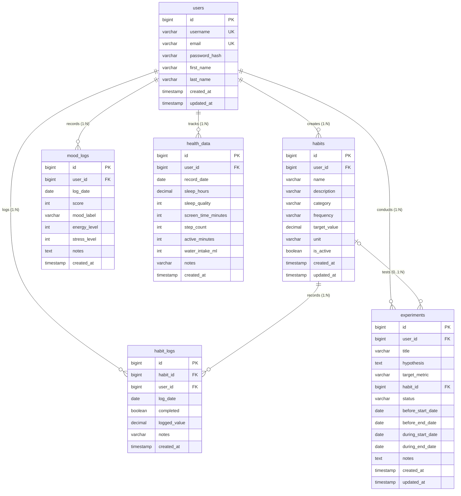

# HabitLoop Database Documentation 📊

This document details the relational database architecture designed for HabitLoop. The schema is implemented for **MySQL 8.0+** using the `InnoDB` storage engine and UTF-8 (`utf8mb4`) encoding.

---

## 🏗️ Entity Relationship Diagram (ERD)



---

## 📋 Tables & Specifications

### 1. `users`
* **Purpose:** Stores user profiles and credentials for authentication and ownership of all personal data.
* **Key Columns:**
  * `id` (`BIGINT AUTO_INCREMENT PRIMARY KEY`): Unique user identifier.
  * `username` (`VARCHAR(50) NOT NULL UNIQUE`): Unique login/display handle.
  * `email` (`VARCHAR(100) NOT NULL UNIQUE`): Unique contact address.
  * `password_hash` (`VARCHAR(255) NOT NULL`): Secure hashed credential.
  * `created_at` / `updated_at`: Audit timestamps.
* **Relationships:**
  * One-to-many with `habits`, `habit_logs`, `mood_logs`, `health_data`, and `experiments`.
  * Deleting a user cascades (`ON DELETE CASCADE`) to all related records.

---

### 2. `habits`
* **Purpose:** Stores custom habit definitions configured by users.
* **Key Columns:**
  * `id` (`BIGINT AUTO_INCREMENT PRIMARY KEY`): Unique habit identifier.
  * `user_id` (`BIGINT NOT NULL`): Owner user ID (`FK -> users.id`).
  * `name` (`VARCHAR(100) NOT NULL`): Habit title (e.g., "Morning Run", "Read 20 Pages").
  * `category` (`VARCHAR(50) NOT NULL DEFAULT 'GENERAL'`): Categorization (e.g., `FITNESS`, `PRODUCTIVITY`, `MINDFULNESS`, `HEALTH`, `LIFESTYLE`).
  * `frequency` (`VARCHAR(30) NOT NULL DEFAULT 'DAILY'`): Target frequency (`DAILY`, `WEEKLY`).
  * `target_value` (`DECIMAL(6,2) NOT NULL DEFAULT 1.00`): Goal target per session.
  * `unit` (`VARCHAR(30) NOT NULL DEFAULT 'times'`): Measurement unit (`times`, `minutes`, `pages`, `km`, `ml`).
  * `is_active` (`BOOLEAN NOT NULL DEFAULT TRUE`): Soft-archive toggle.
* **Constraints & Indexes:**
  * `CHECK (target_value > 0)`: Ensures non-negative goals.
  * `idx_habits_user_active (user_id, is_active)`: Optimizes user habit list queries.
  * `idx_habits_category (user_id, category)`: Fast category aggregation.

---

### 3. `habit_logs`
* **Purpose:** Stores daily check-ins, completion flags, and progress logged against defined habits.
* **Key Columns:**
  * `id` (`BIGINT AUTO_INCREMENT PRIMARY KEY`): Log record identifier.
  * `habit_id` (`BIGINT NOT NULL`): Reference to parent habit (`FK -> habits.id`).
  * `user_id` (`BIGINT NOT NULL`): Direct user reference (`FK -> users.id`) for efficient user-level analytics queries without unnecessary table joins.
  * `log_date` (`DATE NOT NULL`): Date of the tracked habit instance.
  * `completed` (`BOOLEAN NOT NULL DEFAULT TRUE`): Binary completion indicator.
  * `logged_value` (`DECIMAL(6,2) NOT NULL DEFAULT 1.00`): Measured amount completed.
  * `notes` (`VARCHAR(255)`): Optional reflection or note.
* **Constraints & Indexes:**
  * `UNIQUE KEY uk_habit_logs_date (habit_id, log_date)`: **Prevents duplicate entries** for the same habit on the same day.
  * `idx_habit_logs_user_date (user_id, log_date)`: Accelerates dashboard views and streak queries.
  * `idx_habit_logs_habit_date (habit_id, log_date)`: Accelerates individual habit completion analysis.

---

### 4. `mood_logs`
* **Purpose:** Tracks emotional state, perceived stress, and energy levels over time.
* **Key Columns:**
  * `id` (`BIGINT AUTO_INCREMENT PRIMARY KEY`): Mood log entry identifier.
  * `user_id` (`BIGINT NOT NULL`): User reference (`FK -> users.id`).
  * `log_date` (`DATE NOT NULL`): Date of mood entry.
  * `score` (`INT NOT NULL`): Mood rating on a standardized 1–10 scale.
  * `mood_label` (`VARCHAR(50)`): Descriptive tag (e.g., 'Happy', 'Calm', 'Stressed', 'Tired', 'Productive').
  * `energy_level` (`INT`): Subjective energy on a 1–10 scale.
  * `stress_level` (`INT`): Subjective stress on a 1–10 scale.
* **Constraints & Indexes:**
  * `UNIQUE KEY uk_mood_logs_user_date (user_id, log_date)`: Consolidates one daily entry per user.
  * `CHECK (score BETWEEN 1 AND 10)`: Enforces valid rating boundaries.
  * `idx_mood_logs_user_date (user_id, log_date)`: Accelerates time-series trend analysis and experiment correlations.

---

### 5. `health_data`
* **Purpose:** Consolidated daily physical metrics (sleep, digital screentime, steps, and activity).
* **Key Columns:**
  * `id` (`BIGINT AUTO_INCREMENT PRIMARY KEY`): Health record identifier.
  * `user_id` (`BIGINT NOT NULL`): User reference (`FK -> users.id`).
  * `record_date` (`DATE NOT NULL`): Calendar date of metrics.
  * `sleep_hours` (`DECIMAL(4,2)`): Hours of sleep (range 0.00 to 24.00).
  * `sleep_quality` (`INT`): Perceived sleep quality on a 1–10 scale.
  * `screen_time_minutes` (`INT`): Total screen time in minutes (0 to 1440).
  * `step_count` (`INT`): Daily pedometer step count (>= 0).
  * `active_minutes` (`INT`): Moderate-to-vigorous activity time in minutes (0 to 1440).
  * `water_intake_ml` (`INT`): Daily water consumed in milliliters (>= 0).
* **Constraints & Indexes:**
  * `UNIQUE KEY uk_health_data_user_date (user_id, record_date)`: Prevents multiple health records on the same day for a user.
  * Domain check constraints on all numeric fields preventing negative or physically impossible values.
  * `idx_health_data_user_date (user_id, record_date)`: Enables rapid range scans for sleep, screen time, and activity statistics.

---

### 6. `experiments`
* **Purpose:** Manages personal A/B or before-vs-during self-experiments to test lifestyle interventions.
* **Key Columns:**
  * `id` (`BIGINT AUTO_INCREMENT PRIMARY KEY`): Experiment identifier.
  * `user_id` (`BIGINT NOT NULL`): User conducting the experiment (`FK -> users.id`).
  * `title` (`VARCHAR(150) NOT NULL`): Brief title (e.g., "Digital Sunset: No Phone After 9 PM").
  * `hypothesis` (`TEXT`): User's prediction.
  * `target_metric` (`VARCHAR(50) NOT NULL`): Metric to be evaluated (`SLEEP_HOURS`, `MOOD_SCORE`, `SCREEN_TIME_MINUTES`, `ACTIVE_MINUTES`, `STEP_COUNT`, `HABIT_COMPLETION`).
  * `habit_id` (`BIGINT NULL`): Optional reference to an associated habit being tested (`FK -> habits.id ON DELETE SET NULL`).
  * `status` (`VARCHAR(30) NOT NULL DEFAULT 'ACTIVE'`): Workflow state (`PLANNED`, `ACTIVE`, `COMPLETED`, `CANCELLED`).
  * `before_start_date` / `before_end_date` (`DATE NOT NULL`): Baseline evaluation window.
  * `during_start_date` / `during_end_date` (`DATE NOT NULL`): Intervention evaluation window.
* **Constraints & Indexes:**
  * Date order check constraints ensuring valid time windows (`before_start <= before_end <= during_start <= during_end`).
  * `idx_experiments_user_status (user_id, status)`: Fast filtering of active vs. completed experiments.

---

## 🚀 Running the SQL Scripts

To initialize or reset the database locally:

```bash
# 1. Execute schema creation
mysql -u root -p < database/schema.sql

# 2. Populate sample test data
mysql -u root -p < database/seed.sql
```
